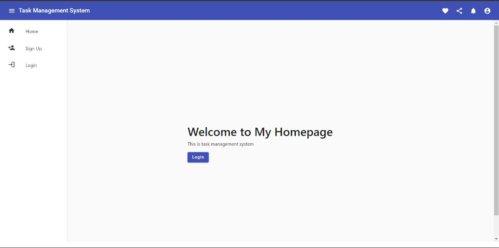
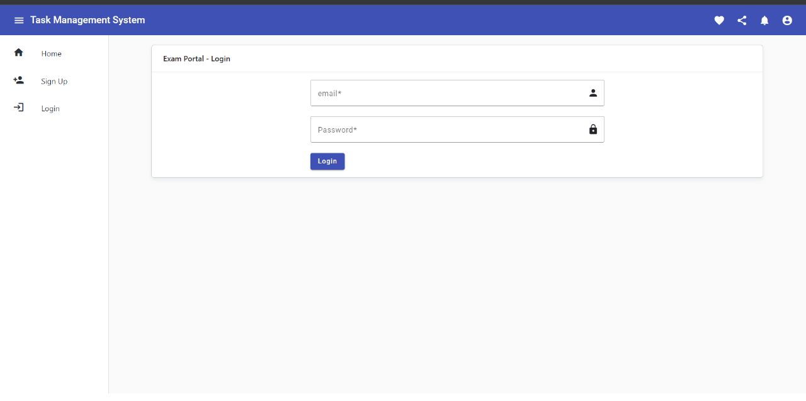
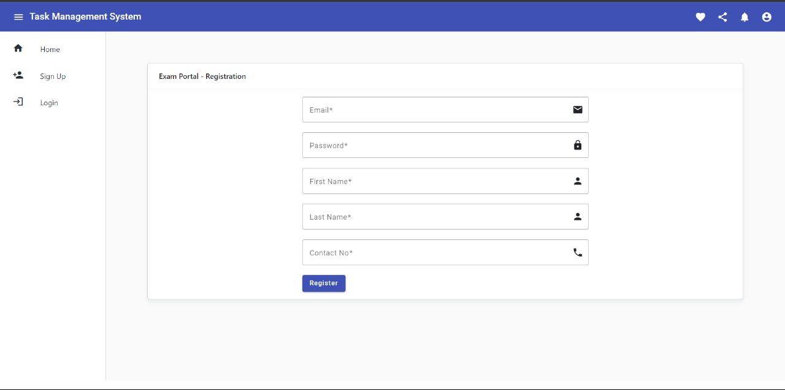
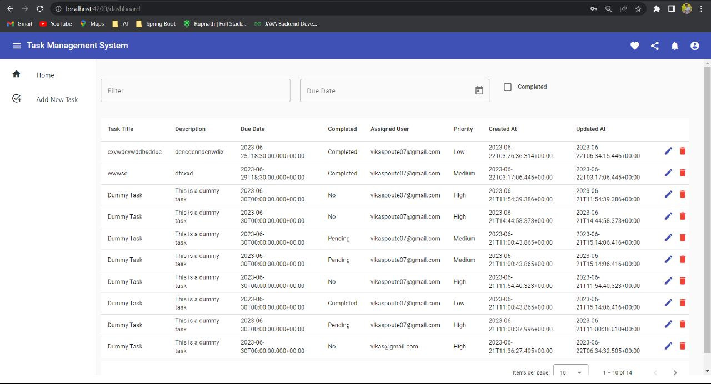
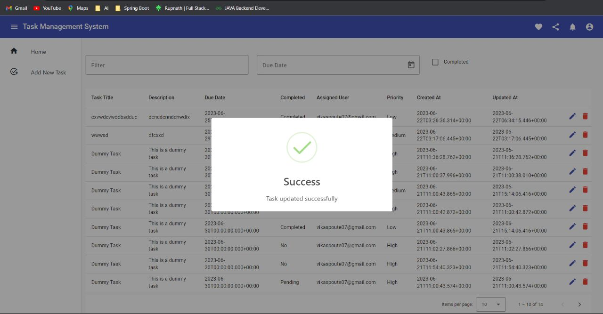

Certainly! Here's an updated version of the README file with image titles:

# Task-Management-System



The Task Management System is a web application designed to help users efficiently manage their tasks and projects. This project consists of an Angular frontend and a Java Spring Boot backend, utilizing a MySQL database for data storage.

## Prerequisites

Before running the project, please ensure that you have the following dependencies installed on your machine:

- [Node.js](https://nodejs.org) (version 12 or above)
- [Angular CLI](https://angular.io/cli) (version 12 or above)
- [Java Development Kit (JDK)](https://www.oracle.com/java/technologies/javase-jdk11-downloads.html) (version 8 or above)
- [MySQL Server](https://dev.mysql.com/downloads/mysql/) (version 8 or above)

## Installation

To set up the project, follow these steps:

1. Clone the repository to your local machine:

   ```
   git clone https://github.com/VikasPoute/Task-Management-System.git
   ```

2. Navigate to the project directory:

   ```
   cd Task-Management-System
   ```

3. Set up the frontend:

   - Navigate to the frontend directory:

     ```
     cd frontend
     ```

   - Install the required dependencies using npm:

     ```
     npm install
     ```

4. Set up the backend:

   - Navigate to the backend directory:

     ```
     cd ../backend
     ```

   - Import the project into your preferred Java IDE (e.g., [IntelliJ IDEA](https://www.jetbrains.com/idea/), [Eclipse](https://www.eclipse.org/ide/)).
   - Resolve the dependencies specified in the `pom.xml` file using your IDE or [Maven](https://maven.apache.org/).

5. Configure the database connection:

   - Open the `backend/src/main/resources/application.properties` file.
   - Modify the values in this file to match your MySQL database configuration (e.g., database name, username, password).

6. Build the project:

   - Build the Angular frontend:

     ```
     ng build
     ```

   - Build the Java Spring Boot backend using your IDE or Maven.

7. Run the project:

   - Start the Java Spring Boot backend server using your IDE or Maven.
   - The frontend will be automatically served by the backend server.

8. Open a web browser and visit `http://localhost:8080` to access the Task Management System.

## Usage

Once the project is set up and running, you can use the Task Management System to manage your tasks and projects. Some key features of the application include:

- **User Registration and Login**: Users can register for a new account or log in to an existing account.
- **Task Creation and Assignment**: Users can create new tasks and assign them to themselves or other users.
- **Task Tracking**: Users can update the status, progress, and due dates of tasks.
- **Task Prioritization**: Users can prioritize tasks based on urgency and importance.
- **Comments and Attachments**: Users can add comments and attach files to tasks for better collaboration.
- **Reports and Statistics**: Users can generate reports and visualize task statistics.

## Contributing

Contributions are welcome! If you would like to contribute to this project, please follow these steps:

1. Fork the repository on GitHub.
2. Create a new branch for your feature or bug fix.
3. Commit your changes and push them to your fork.
4. Submit a pull request detailing your changes.

## License

This project is licensed under the MIT License. See the [LICENSE](vikaspoute@gmail.com) file for more information.

## Contact

If you have any questions or suggestions regarding this project, please contact the project owner at [vikaspoute@gmail.com]

---

# Some Image of this project

## Login


## Registration


## dashboard


## configuration 


## success



Thank you for using the Task Management System! We hope it helps you stay organized and productive.
